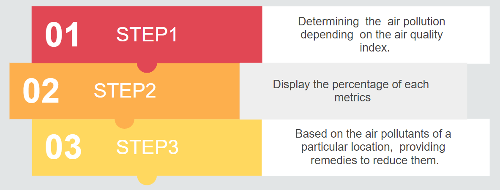

### CONTENTS

- [Project name](#project-name)
  - [Short description](#short-description)
    - [What's the problem?](#whats-the-problem)
    - [How can technology help?](#how-can-technology-help)
    - [The idea](#the-idea)
  - [The architecture](#the-architecture)
  - [Long description](#long-description)
  - [Demo video](#demo-video)
  - [Project roadmap](#project-roadmap)
  - [Approach](#approach)
  - [Integration](#integration)
  - [Getting started](#getting-started)
  - [Authors](#authors)
  - [Acknowledgments](#acknowledgments)

# GREEN EARTH  

## Short description

### What's the problem?

Air pollution refers to the release of pollutants into the air that are detrimental to human health and the planet as a whole. Around the world, nine out of 10 people breathe unhealthy air. Air pollution is now the biggest environmental risk for early death, responsible for more than 6 million premature deaths each year from heart attacks, strokes, diabetes and respiratory diseases. That’s more than the deaths from AIDS, tuberculosis and malaria combined.Research suggests that long term exposure to some pollutants increases the risk of emphysema more than smoking a pack of cigarettes a day. And recent studies show air pollution can impact mental health, worker productivity and even stock market performance.

### How can technology help?

Technology will help us to analyse  and determine the problem factors and provide solutions  to combat them. Some of these are Google Cloud Apis, IBM Cloud services and several other open source technologies.

### The idea
The idea is to use IoT integration to pull the air quality index through cloud service functions and store them in cloud storage for current and future data analysis. Cognitive devices will read these data and based on that we can device technologies to create a healthier society for tomorrow.

## The architecture

## Long description

[More detail is available here](./docs/Description.md)

## Demo video

## Project roadmap

- The main objective of this project is to determine the air pollution depending on the air quality index for any geographical location.  

- After identifying the air pollution for particular location, we can state remedies to reduce the same.

- Identifying greeneries of any geographical locations and thus determining requirement of plantation of trees.

## Approach  

- (Open-Source ) Technologies Used :
### Front End
	React
### Middleware
	NodeJS 
	Python 
### Data Storage
	Object Storage (s3)
### Machine Learning analysis
	Python
### Deployment
	Heroku  

## Node JS Modules used 

  "axios": "^0.21.1",
  "cors": "^2.8.5",
  "express": "^4.17.1",
  "fs": "0.0.1-security",
  "ibm-cos-sdk": "^1.10.0"

## Python Modules used 

  Click==7.0
  Flask==1.1.1
  gunicorn==19.9.0
  itsdangerous==1.1.0
  Jinja2==2.10.1
  MarkupSafe==1.1.1
  Werkzeug==0.15.6
  pandas==1.0.1
  pandas-datareader==0.8.1
  numpy==1.18.1
  scikit-image==0.16.2
  scikit-learn==0.22.1
  scipy==1.4.1
  seaborn==0.10.1
  ibm-cos-sdk == 2.10.0
  boto3==1.17.9
​
## Microservices Details 
1. Node JS 
2. Python
​
## Integration

Fetching the pollution index from various geolocations using react and then passing it to express. The data is then written into csv and is stored in IBM cloud. Then using python integration the metrics is displayed in a graphical manner. 

## Getting started

 [Green Earth App](https://greenearth-node.herokuapp.com/)

- We have used 3 different services that are running in 3 different ports in Local. React App is running on the server 3000, Express is running on 9000. 

- You have to install the Express and react packages in local/node_modules, for this you need to do npm i in both the locations where express side of code is residing with package.json and inside client directory where react side of the code is residing.

- Once You have installed the packages you have to use your own Google Api key for [google-maps](https://www.google.com/maps) and also for [open-weather](https://openweathermap.org/)

- Once you have enabled the API KEYS, do npm start in both express and React location.

## Authors
- **Karabi Bajaj**  - bajaj.karabi@in.ibm.com
- **Arnab Chaterjee**  - arnacha1@in.ibm.com
- **Sudipto Dasgupta** - sudidasg@in.ibm.com
- **Deepanwita Datta** - deepadat@in.ibm.com
- **Sudeshna Seal** - sudeseal@in.ibm.com
- **Sayantani Nath** - sayantani_nath@in.ibm.com

## Acknowledgments

- [React](https://reactjs.org/)
- [HTML](https://html.com/)
- [Python](https://www.python.org/)
- [Heroku](https://www.heroku.com/)
- [nodejs](https://nodejs.org/)
- [Google cloud API](https://cloud.google.com/apis)
